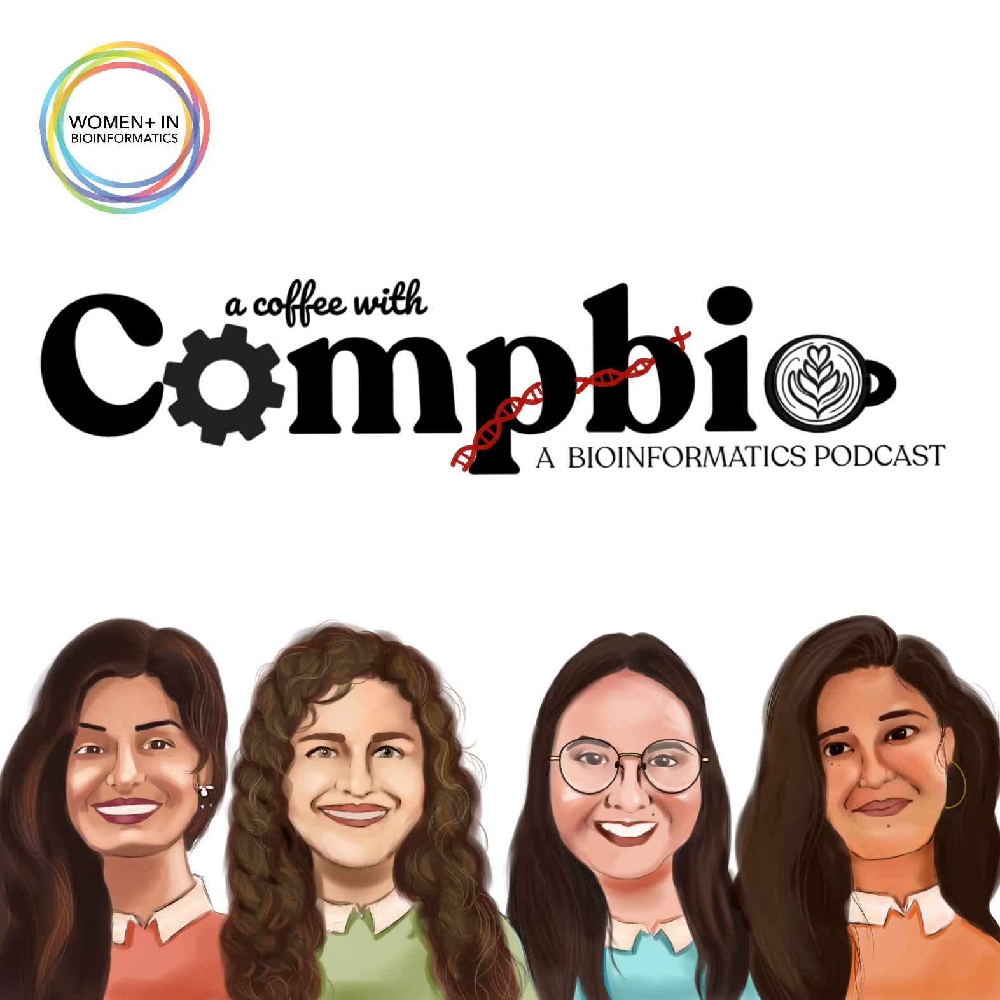

# Resources from A Coffee With Compbio Podcast

## Episode 1

## Episode 2

[Biohackathons](https://biohackathons.github.io/)\
[nf-core hackathons](https://nf-co.re/events/hackathon) \
[nf-core hackathon in March 2026](https://nf-co.re/events/2026/hackathon-march-2026) \
[If you are interested in hosting a hackathon](https://college.harvard.edu/student-life/student-stories/how-i-organized-hackathon-harvard)\
[Bio-IT](https://www.bio-itworldexpo.com/fair-data-hackathon) 

#### General hackathons
[Other hackathons](https://www.openhackathons.org/s/)\
[Major league hackathons](https://www.mlh.com/seasons/2026/events)\
[Codeday](https://www.codeday.org/)\
[devpost](https://devpost.com/)\
[NCBI](https://ncbi-codeathons.github.io/) 

